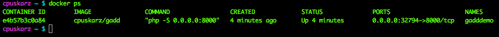

# gadd
##**Gomorrah Automated Distributed Defense**

***TBD:*** Any applicable badges (build/documentation/collaboration/licenses should go here

# Description - Phase 1

The demo will highlight Spark and NFVIS along with ACI and NGIPS*. The idea of the demo is:  based on an event/alert in the datacenter, dynamically deploy a FW at offending remote branch and post notifications in a Spark room. The branch site has a NFVis device and only has a virtual router deployed/functioning as a starting point.

For phase 1, we don't actually have an IPS at the datacenter, so we'll simulate the attack event. However, we do have ACI: we will gather health statistics of a server along with ingress/egress stats and send the information to our Spark room. In Phase 2 the plan is to have an actual IPS to provide 'real' events.

# Installation

## Environment

**Prerequisites**

* Docker, running on a MAC. (Docker PC version of this document is coming at a later date).
* An account on:``developer.ciscospark.com.``(Create an account if you already don't have one).
* A Cisco Spark account:``web.ciscospark.com.``(Create an account if you already don't have one). 
* If you don't have docker or are running a PC, we can run the demo with native python. However, you'll need to the following:
		
	* Python 2.7+ 
	* [setuptools package](https://pypi.python.org/pypi/setuptools)
	* ***other .... (need to fill this in).***

***NOTE 1: We'll be leveraging the local/internal labs for ACI and a NFVIS device, so you'll need connectivity to Cisco internal networks. However, pending future deployments on Cisco DevNet, this requirement might change... TBD (see next note).***

***NOTE 2, TBD: Deployment on Mantl, pending availability of ACI and NFVis accessibility in that environment. Our goal is to install/run in DevNet at a future date.*** 

## Downloading

There are several ways to download this demo; docker container being the easiest.

**Option I:**

The latest build of this project is available as a Docker image from Docker Hub

    docker pull imapex/gadd:tag
You will also need to have an environmental variable file built. There's a template on``github.com/imapex/gadd`` called``my_env_template``that you can use as a starting point. We'll explain later in this docuement on usage. See Option B or C on how to download.

**Option II:**

If you have git installed, clone the repository

    git clone https://github.com/imapex/gadd

If you don't have git, download a zip copy of the repository
and extract.

## Installing

We'll cover a few ways to install and run this demo. You have a choice of using either:  
**- Docker container**   
**- Running the python app native on our laptop.**   
***- TBD: future, running on Mantl.io***

##Option A: Running the Docker container (MAC)
 
###Setup 
After downloading the container and cloning/downloading the repo per above:

* open a terminal and navigate into your downloaded repo directory
* cd into the``gadd``directory
* copy``my_env_template``to``my_env``
* If you are leveraging this demo as-is with the APIC and NFVis devices, you only need to change the TOKEN_INPUT variable. To do so:
	* log into``developer.ciscospark.com``. Click the picture icon in the upper right hand corner of the page and copy your token from the pop-up window.
	* Paste the token into the``my_env``file you created and save the file. Please keep the key word "Bearer". Here's an example:

            TOKEN_INPUT=Bearer R2VkYjClYTgtMTNiYy00YWQ2LY2TkYjBlYTgljNWE4Y2VkYjBlYTgTIyM2I2OTktMzRm
            
* Let's start up the container next by running this command, (make sure you're back in the``gadd``directory and terminal you were in earlier):

		cd ui
		docker run -it -d -P --env-file=my_env --name=gadddemo cpuskarz/gadd 
		
* We'll need to port number. open another terminal window (don't close your current one). Enter:

		docker ps
		
	* You should see output similar to below. Take note of the **PORTS** number, for example**``32794``**:

	

Okay, now lets run the demo.

###Usage  

* Open your Spark client of choice.
* Open a browser to``http://<your docker up address>:8000``
* ... ***do the demo***.... (more work to be done here...)

##Option B: Python app on your laptop without Docker. 

###Setup

After downloading the container and cloning/downloading the repo per above:

* open a terminal and navigate into your downloaded repo directory
* cd into the``gadd``directory
* copy the``gadd_setup_template.sh``to``gadd_setup.sh``.
*  If you are leveraging this demo as-is with the APIC and NFVis devices, you only need to change the TOKEN_INPUT variable. To do so:
	* log into``developer.ciscospark.com``. Click the picture icon in the upper right hand corner of the page and copy your token from the pop-up window.
	* Paste the token into the``gadd_setup_static.sh``file you created and save the file. Please keep the key word "Bearer". Here's an example:

            TOKEN_INPUT=Bearer R2VkYjClYTgtMTNiYy00YWQ2LY2TkYjBlYTgljNWE4Y2VkYjBlYTgTIyM2I2OTktMzRm

* Execute the following commands from within the``gadd``directory, (make sure you're back in the``gadd``directory and terminal you were in earlier):

		source gadd_setup_static.sh
		cd ui
		
	
* You now should be in the``ui``directory. Execute the following commands:

		php -S 0.0.0.0:8000
		
		
Okay, now lets run the demo.	
	

###Usage
* Open your Spark client of choice.
* Open a browser to``http://localhost:8000``
* ... ***do the demo***.... (more work to be done here...)

# Development

Provide any notes for other contributors.  This includes how to run tests / etc

## Linting

We use flake 8 to lint our code. Please keep the repository clean by running:

    flake8

## Testing

The IMAPEX team should attempt to have unittests with  100% code coverage. An example test suite is contained
within the tests.py file for the boilerplate application

The tests are can be run in the following ways::

    python tests.py

When adding additional code or making changes to the project, please ensure that unit tests are added to cover the
new functionality and that the entire test suite is run against the project before submitting the code.
Minimal code coverage can be verified using tools such as coverage.py.

For instance, after installing coverage.py, the toolkit can be run with the command::

    coverage run tests.py

and an HTML report of the code coverage can be generated with the command::

    coverage html

# License

Include any applicable licenses here as well as LICENSE.TXT in the root of the repository

